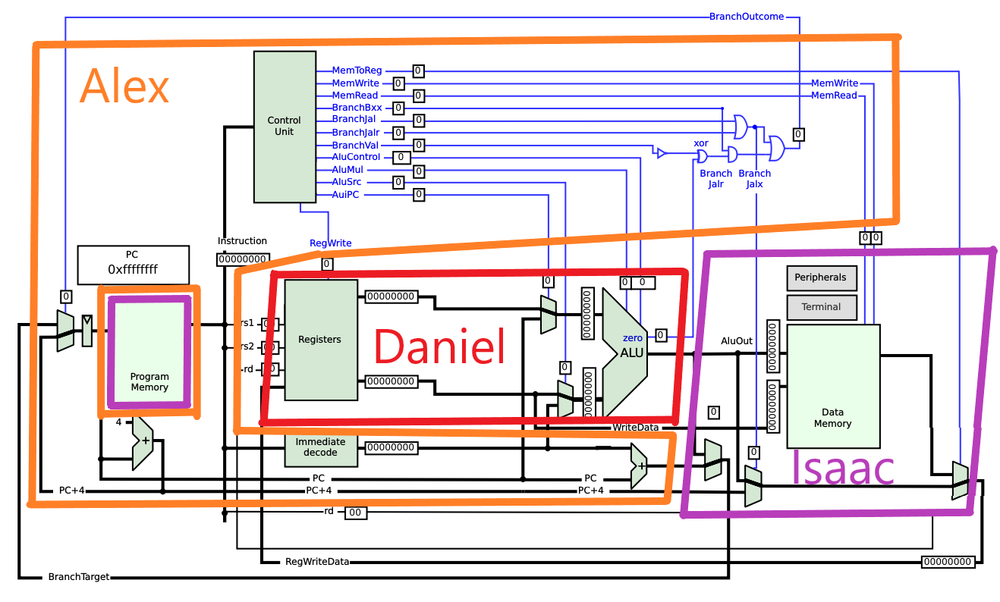

With the impending due date of the final draft of the proposal for this project, we met to make the plans of how we were going to finish the draft and what the rest of the content would be.

The largest decision that was a result of this meeting was splitting our project into stages that help us to use incremental design, and into regions that can be implemented in parallel by each team member.

The hardware stages were decided as:
1. **Verilog**: A full simulation of the design of our processor
2. **Microcontrollers**: A cheaper and easier physical build of the processor made out of multiple microprocessors, providing us a functioning processor we can fall back to
3. **Discrete Logic**: Replace as many functions originally performed by microcontrollers to be performed by TTL chips as we can.

This also involved splitting the processor into a region for each team member, summarized and illustrated as:
- Isaac: Memory and I/O
- Daniel: ALU and Register File
- Alex: Controller and Program Counter

The software was also split into three stages which can implemented in parallel:
- Isaac: Programmer
- Daniel: Compiler
- Alex: Simulator